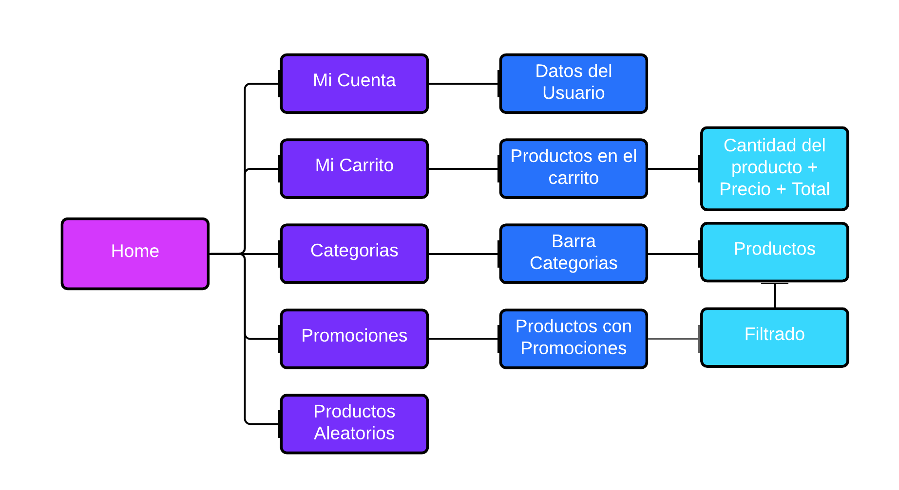
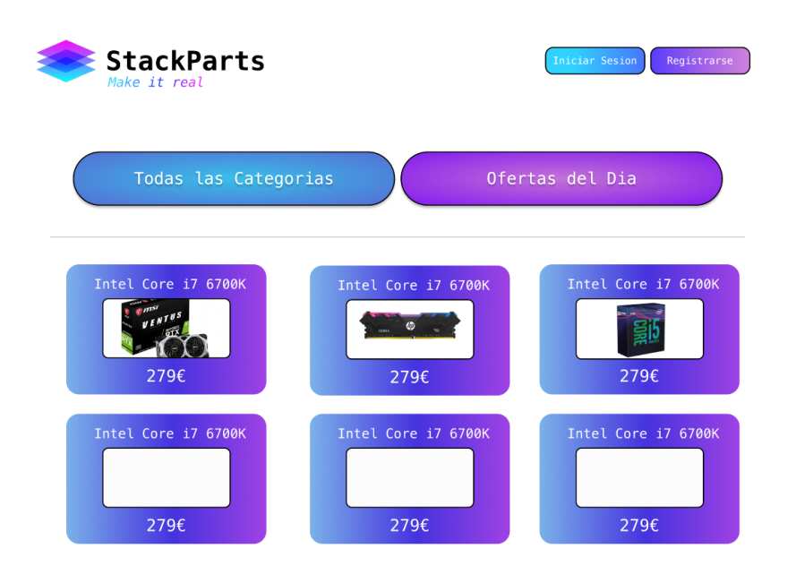
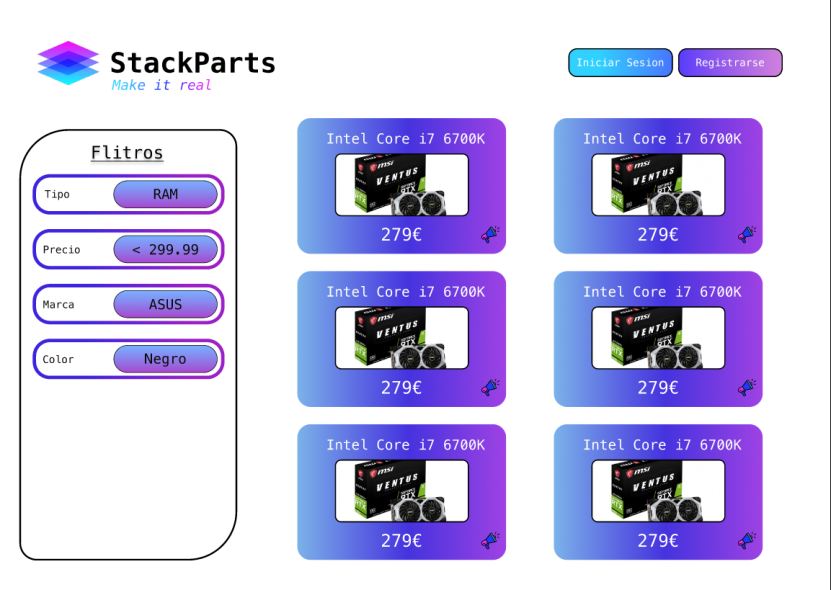
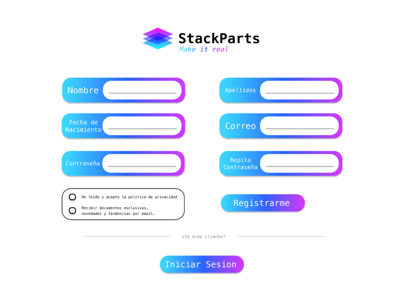
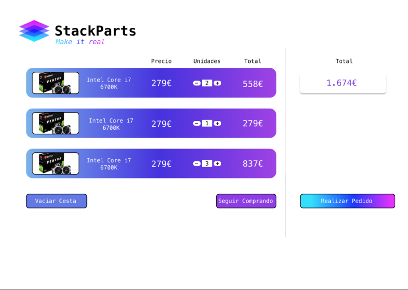
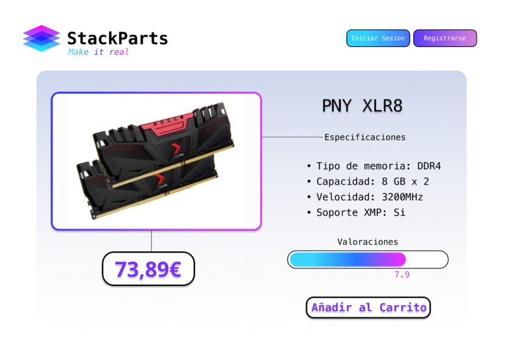

# Anteproyecto - StackParts: Make it real

# Descripcion

Se trata de un portal de compras de hardware. En el cual, el usuario podra comprar componentes hardware para su PC.

El portal sigue el siguiente esquema de paginas:

# Objetivos

* Creacion de Cuenta
  * Iniciar Sesion
  * Registro
* Acceso al Carrito
* Modificacion del perfil
* Pagina Principal
* Promociones (Productos con descuento)
* Categorias
* Pagina de la descripcion del producto
  * Imagen
  * Especificaciones
  * Valoraciones
  * Precio

En la pagina inicial, el usuario podra iniciar sesion o registrarse, asi como acceder a todas las categorias y a las promociones. Una vez dentro de las categorias, el usuario puede crear un filtrado de productos, y tambien acceder a cada detalle del mismo. 

El usuario, una vez loggeado, podra añadir componentes nuevos al carrito o vaciarlo, asi como modificar los datos de su perfil.

# Software y Metodologia

Para el desarrollo de este proyecto se utilizaran las siguientes tecnologias:

* VueJS -> Para el Frontend
* NodeJS / TypeScript -> Para el Backend
* MongoBD -> Para la base de datos

En cuanto a la metodologia emplearemos el metodo SCRUM, la cual es una metodologia agil. Es un proceso en el que se aplican de manera regular un conjunto de buenas prácticas para trabajar colaborativamente, en equipo y obtener el mejor resultado posible de proyectos.

Incluiremos en nuestro proyecto una serie de procesos:

* Planificacion de Sprint

En este proceso se hablara sobre las distintas cuestiones que se abarcaran en un sprint.

* Sprint

Proceso en el que se desarrolla el sprint, el cual constituye el desarrollo del propio codigo

* Daily Standup

Reuniones diarias de 5 a 15 minutos donde se habla sobre el desarrollo del sprint, asi como problemas que vayan surgiendo.

* Revisión de sprint

Se efectua una reunión de revisión de sprint, donde se presentan los trabajos completados.

# Mockup

Para visualizar todos los mockups, puede visitar el siguiente [enlace](https://www.figma.com/proto/vAUNbIljtyyt0SGJGU0g5f/Stack-Parts-Prototype?page-id=0%3A1&node-id=7%3A2&viewport=241%2C48%2C0.23&scaling=scale-down&starting-point-node-id=7%3A2&show-proto-sidebar=1).