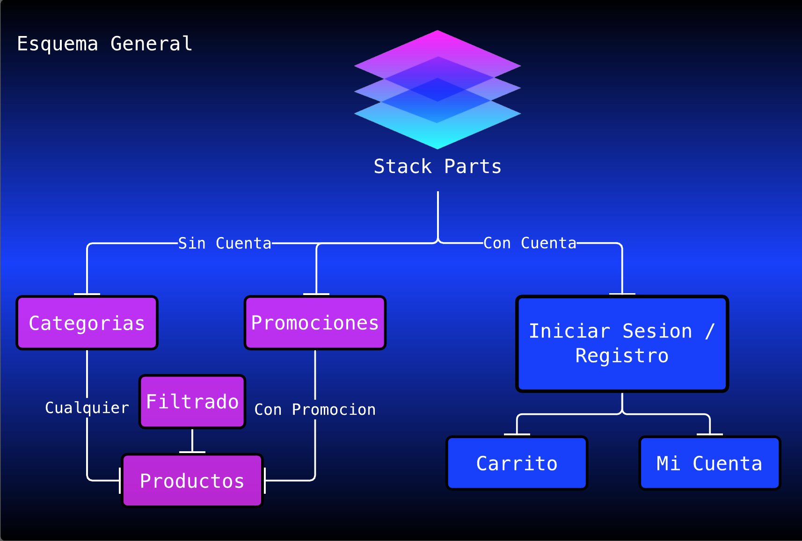

# Anteproyecto

## StackParts: Make it real

Se trata de un portal de compras de hardware. En el cual, el usuario podra comprar un componente hardware para su PC.

El portal sigue el siguiente esquema de paginas:

En la pagina inicial, el usuario podra iniciar sesion o registrarse, asi como acceder a todas las categorias y a las promociones. Una vez dentro de las categorias, el usuario puede crear un filtrado de productos. Por otro lado, el usuario podra iniciar sesion o en caso de no tener una cuenta, este podra registrarse. Una vez registrado, el usuario puede añadir componentes nuevos al carrito.