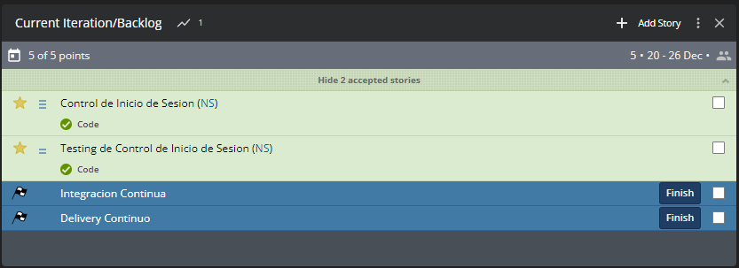

# CI/CD - StackParts: Make it real

## Descripcion

En esta iteracion vamos a asignar las tareas para realizar la integracion continua, asi como el delivery continuo (CI/CD)

## Tareas en Pivotal Tracker



En la imagen podemos ver que se ha completado las tareas de la iteracion anterior, asi como las nuevas que se van a realizar durante la semana.

## Continuous Integration

La integración continua es una práctica de ingeniería de software que consiste en hacer integraciones automáticas de un proyecto lo más a menudo posible para así poder detectar fallos cuanto antes. Entendemos por integración la **compilación** y **ejecución** de pruebas de todo un proyecto.

Para este proyecto vamos a utilizar la herramienta Travis CI para la integracion continua.

## Continuous Delivery/Deployment

Cuando nos referimos a CD, nos encontramos con dos acronimos diferentes, Continuous Delivery (Entrega Continua) o Continuous Deployment (Despliegue Continuo)

* Entrega continua:

La entrega continua es una extensión de la integración continua, ya que implementa automáticamente todos los cambios de código en un entorno de pruebas o producción después de la fase de compilación.

Esto significa que, además de las pruebas automatizadas, cuentas con un proceso de publicación automatizado y puedes implementar la aplicación en cualquier momento haciendo clic en un botón.

* Despliegue Continuo:

La implementación continua va un paso más allá que la entrega continua. Mediante esta práctica, los cambios que pasan por todas las fases de tu canalización de producción se publican para tus clientes. No hay intervención humana y solo una prueba fallida evitará implementar un nuevo cambio en la producción.

## CI/CD en StackParts

En cuanto a este proyecto, utilizaremos la herramienta Travis CI para la integracion continua. Sera necesario la creacion de un archivo llamado ```.travis.yml``` el cual contendra las instrucciones para que las ejecute el servicio de Travis CI cuando se pusheen los cambios a git.

Ademas de Travis usaremos otro tipo de herramientas, como Docker y Github Actions (similar a Travis CI).

* Docker:

Docker es un proyecto de código abierto que automatiza el despliegue de aplicaciones dentro de contenedores de software, proporcionando una capa adicional de abstracción y automatización de virtualización de aplicaciones en múltiples sistemas operativos.

