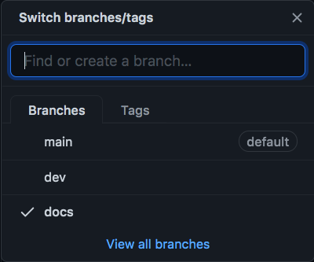
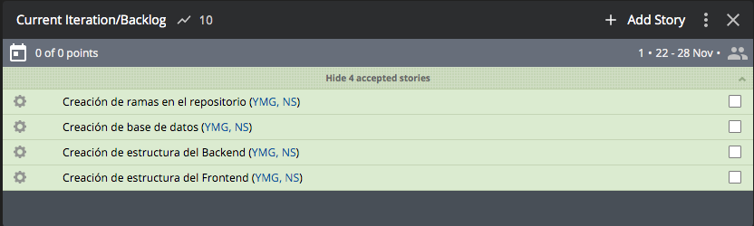
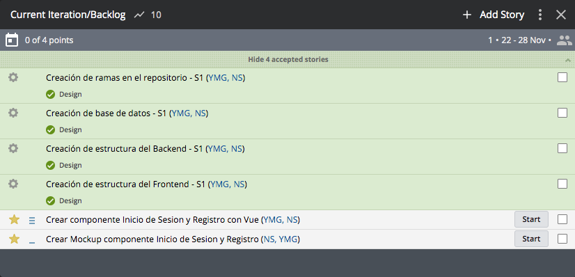

# Data Models - StackParts: Make It Real

Durante la semana hemos realizado las tareas planteadas en Pivotal Tracker:

* Creacion de Ramas en Gitub
* Creacion de la base de datos
* Creacion de estructura de backend
* Creacion de estructura de frontend

## Creacion de Ramas

La idea principal de esta tarea es tener claro las ramas que se van a utilizar durante el proyecto, en este caso, tendremos 3 ramas, luego aumentaremos a 4. A priori usaremos las ramas docs (Para la creacion de documentacion e informe), la rama dev (Para subir el codigo) y la rama main, donde se subira el codigo terminado. Con el paso del tiempo implementaremos la rama prod, donde subiremos el codigo listo para desplegar, asi como realizar las tareas de integracion continua.



## Creacion de la base de datos

En esta tarea crearemos la estructura de cada modelo de datos dentro de la base de datos. Primero, para la creacion de la base de datos usaremos la herramienta mongoDB Atlas, donde estara alojada la base de datos.

En el proyecto tenemos cuatro diferentes objetos:

* Usuario

```js
const userSchema = new Schema({
  email: {
    type: String,
    unique: true
  },
  password: {
    type: String,
    required: true
  },
  name: {
    type: String,
    required: true
  },
  surname: {
    type: String,
    required: true
  },
  role: {
    ref: 'Role',
    type: Schema.Types.ObjectId
  }
},
{
  versionKey: false
});
```

* Roles

```js
const roleSchema = new Schema({
  name: {
    type: String,
    unique: true
  }
},
{
  versionKey: false
});
```

* Categoria

```js
const categorySchema = new Schema({
  name: String,
  imgURL: String
},
{
  versionKey : false
});

```

* Producto

```js
const productSchema = new Schema({
  category: String,
  name: String,
  price: Number,
  imgURL: String,
  discount: Boolean,
  espec: [String]
},
{
  versionKey : false
});
```

**Todos estos modelos estan implementados en la carpeta ```models``` dentro del backend**

## Creacion de la estructura del frontend y el backend

Para la creacion de la estructura del frontend (Vue) hicimos uso de la interfaz grafica que ofrece Vue para la creacion de proyectos.


Esto se hace con el siguiente comando:

```bash
vue ui
```

La estructura de ficheros quedaria asi:

```json
/public
/src
  /assets
  /components
  App.vue
  main.js
.gitignore
babel.config.js
packege-lock.json
package.json
README.md
```

Para la creacion de la estructura del backend hicimos uso de un comando de node para crear proyectos:

```js
npm init -y
```

```json
/src
  index.js
.gitignore
packege-lock.json
package.json
```

## Tareas semanales finalizadas



## Tareas para la semana 2

