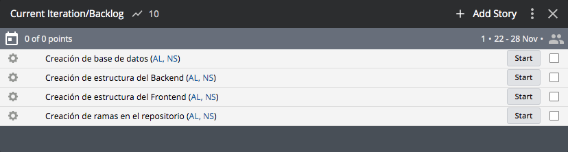

# Inception - StackParts: Make it real

# Descripcion

En esta practica se va a hacer uso de la herramienta Pivotal Tracker, la cual consiste en hacer un seguimiento exhaustivo de las tareas que se van realizando a lo largo del proyecto, asi como su dificultad, revisiones, etc.

# Creacion de Tareas

* Tarea 1: Creacion de ramas en el repositorio.
* Tarea 2: Creacion de estructura del Frontend.
* Tarea 3: Creacion de estructura del Backend.
* Tarea 4: Creacion de base de datos.

# Asignacion de Tareas

Las 4 tareas estan asignadas a todos los miembros del grupo.

