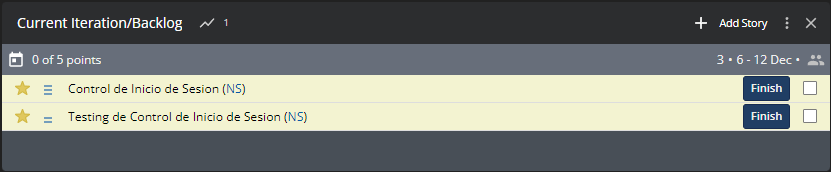

# Session Management and Testing - StackParts: Make it Real

# Descripcion

En esta practica vamos a elaborar el codigo y el testeo del control de sesion de los usuarios de la pagina.

# Tareas en Pivotal Tracker



# Control de Inicio de Sesion

```html
<form 
      @submit.prevent="login(usuario)"
      method="POST">
```

Como vemos el formulario contiene el atributo ```@submit.prevent="login(usuario)"```, cuando se ejecuta el boton ```submit```, se llama a la funcion ```login(usuario)```. La cual la usamos con el mapActions de Vuex.

```js
<script>
  import { mapActions } from "vuex";
  export default {
    name: "LoginForm",
    data() {
      return {
        usuario: {
          email: "",
          password: "",
        },
      };
    },
    methods: {
      ...mapActions(["login"]), // <-
    }
  }
</script>
```

El store del login funciona asi:

```js
import axios from "axios";

const url = "http://tecnored.xyz:4000/auth/signin"

const actions = {
  async login({ commit }, usuario) {
    let errorId = document.getElementById("errores")

    try {
      const response = await axios.post(url, usuario);
      commit("setToken", response.data.token);
      localStorage.setItem("token", response.data.token);
      window.location.href="/"
    } catch {
      commit("setToken", null);
      errorId.style.display = "block";
      errorId.innerHTML = '<i class="fas fa-exclamation-triangle"></i> Usuario y/o Contraseña Incorrecta';
    }
  },
}


export default { actions };
```

Vemos al ```axios.post(url, usuario)```:

```js
import User from '../models/user.models';

export const signIn = async (request, response) => {
  const content = request.body;
  const userFound = await User.findOne({"email": content.email}).populate('role');

  if(!userFound) return response.status(404).json("Usuario no encontrado");
  
  if(!await User.comparePassword(content.password, userFound.password)){
    return response.status(401).json({"token": null, message: "Contraseña incorecta"});
  }

  const token = jwt.sign({id: userFound._id},config.secretTokenGenerator,{
    expiresIn: 86400 // 24 horas
  });
  response.status(201).json({token})
}
```

Con esto ya tendriamos controlado el inicio de sesion, solo faltaria los tests.

# Testing de Inicio de Sesion

```js
const mongoose = require('mongoose')
const supertest = require('supertest')
const {app, server} = require('../src/index')

import User from '../src/models/user.models';

const api = supertest(app)

beforeEach(async () => {
  await User.deleteMany({})

  await new User({
    "email": "user0@test.com",
    "password": await User.encryptPassword("user0test"),
    "name": "User0",
    "surname": "Test"
  }).save()
  await new User({
    "email": "user1@test.com",
    "password": await User.encryptPassword("user1test"),
    "name": "User1",
    "surname": "Test"
  }).save()
})

test("SignIn", async () => {
  const dataUser = {
    "email": "user0@test.com",
    "password": "user0test"
  }

  await api
    .post("/auth/signIn")
    .send(dataUser)
    .expect(201)
    .expect('Content-Type', /application\/json/);
})
```

# Registro de Usuarios

Al igual que en el inicio de sesion, en el registro se utiliza un formulario:

```html
 <form id="registerForm" @submit.prevent="register(usuario)" method="POST">
```

Cargamos la funcion ```register(usuario)``` con el mapActions:

```js
<script>
  import { mapActions } from "vuex";
  export default {
    name: "RegisterForm",  
    data() {
      return {
        usuario: {
          email: "",
          password: "",
          re_password: "",
          date: "",
          name: "",
          surname: ""
        },
      };
    },
    methods: {
      ...mapActions(["register"]),
    }
  }
</script>
```

La funcion register hace lo siguiente:

```js
import axios from "axios";

const url = "http://tecnored.xyz:4000/auth/signup"

const actions = {
  async register({ commit }, usuario) {
    let errorId = document.getElementById("errores")
    
    let fecha_user = usuario.date.split("-");
    let date_actual = new Date();
    let date_user = new Date(parseInt(fecha_user[0]),parseInt(fecha_user[1])-1,parseInt(fecha_user[2]));

    if(usuario.name.length < 3){
      errorId.style.display = "block";
      errorId.innerHTML = '<i class="fas fa-exclamation-triangle"></i> Nombre muy Corto';
      return
    }

    if(usuario.surname.length < 3){
      errorId.style.display = "block";
      errorId.innerHTML = '<i class="fas fa-exclamation-triangle"></i> Apellido muy corto';
      return
    }

    if(date_user > date_actual){
      errorId.style.display = "block";
      errorId.innerHTML = '<i class="fas fa-exclamation-triangle"></i> Fecha no valida';
      return
    }

    const regex = /^(([^<>()[\]\\.,;:\s@"]+(\.[^<>()[\]\\.,;:\s@"]+)*)|(".+"))@((\[[0-9]{1,3}\.[0-9]{1,3}\.[0-9]{1,3}\.[0-9]{1,3}\])|(([a-zA-Z\-0-9]+\.)+[a-zA-Z]{2,}))$/;
    if(!regex.test(String(usuario.email).toLowerCase())){
      errorId.style.display = "block";
      errorId.innerHTML = '<i class="fas fa-exclamation-triangle"></i> Correo no valido';
      return
    }

    if (usuario.password != usuario.re_password) {
      errorId.style.display = "block";
      errorId.innerHTML = '<i class="fas fa-exclamation-triangle"></i> Las contraseñas deben ser iguales';
      return
    }

    if (usuario.password.length < 8) {
      errorId.style.display = "block";
      errorId.innerHTML = '<i class="fas fa-exclamation-triangle"></i> La contraseña debe superar los 7 caracteres';
      return
    }

    try {
      const response = await axios.post(url, usuario);
      commit("setToken", response.data.token);
      localStorage.setItem("token", response.data.token);
      window.location.href="/"
    } catch {
      commit("setToken", null);
      errorId.style.display = "block";
      errorId.innerHTML = '<i class="fas fa-exclamation-triangle"></i> Correo ya en uso';
    }
  },
}
```

Primero se comprueban que todos los datos introducidos estan correctos. Luego se hace la peticion para introducir el usuario nuevo.

```js
export const signUp = async (request, response) => {
  const content = request.body

  const oldUser = await User.findOne({"email": content.email});
  if(oldUser) return response.status(409).json({message: "Correo ya en uso"})

  const newUser = new User({
    email: content.email,
    password: await User.encryptPassword(content.password),
    name: content.name,
    surname: content.surname
  });

  if(content.role){
    const foundRole = await Role.findOne({name: content.role})
    newUser.role = foundRole._id;
  }
  else {
    const foundRole = await Role.findOne({name: "user"})
    newUser.role = foundRole._id;
  }

  console.log(newUser);

  newUser.save()
  .then(result => {
    const token = jwt.sign({id: result._id},config.secretTokenGenerator,{
      expiresIn: 86400 // 24 horas
    });
    response.status(201).json({token})
  })
  .catch (err => {
    response.status(400).json({message: "Error"});
  });
}
```

# Testing de Registro de Usuario

```js
test("SignUp", async () => {
  const userData = {
    "email": "user2@test.com",
    "password": "user2test",
    "name": "User2",
    "surname": "Test"
  }
  await api
    .post("/auth/signup")
    .send(userData)
    .expect(201)
    .expect('Content-Type', /application\/json/);
})
```

