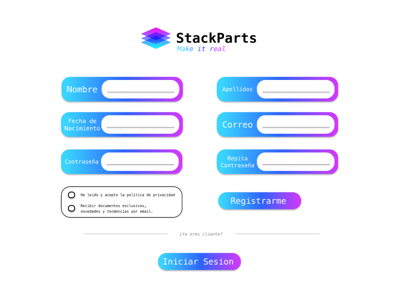

# Inception - StackParts: Make it real

## Descripcion

En esta iteracion vamos a crear los modelos del inicio de sesion y registro, asi como el codigo de los componentes.

## Tareas en Pivotal Tracker


## MockUps [Figma]

* [Inicio de Sesion (Link)]("https://www.figma.com/proto/vAUNbIljtyyt0SGJGU0g5f/Stack-Parts-Prototype?node-id=22%3A283&scaling=scale-down&page-id=0%3A1&starting-point-node-id=36%3A197")


* [Registro (Link)](https://www.figma.com/proto/vAUNbIljtyyt0SGJGU0g5f/Stack-Parts-Prototype?node-id=22%3A395&scaling=scale-down&page-id=0%3A1&starting-point-node-id=36%3A197)



## Componentes en Vue

* [Inicio de Sesion (Link)](https://github.com/SyTW-2122/E17/blob/dev/frontend/src/components/LoginForm.vue)

```html
<template>
  <div class="container">
    <form>
      <div class="campo gradient">
        <div class="text_form">
          Correo:
        </div>
        <div class="input_form">
          <input type="email" name="email" autocomplete="on" required placeholder="__________________  ">
        </div>
      </div>
      <div class="campo gradient">
        <div class="text_form">
          Contraseña:
        </div>
        <div class="input_form">
          <input type="password" name="password" autocomplete="current-password" required placeholder="__________________  ">
        </div>
      </div>
      <div>
        <button class="signin gradient" type="submit" style="cursor: pointer;"> Iniciar Sesion </button>
      </div>
    </form>

    <!-- Manejo de errores -->
    <div id="errores" class="erroes">
    </div>
    <!-- Manejo de errores -->

    <div class="separator">
      <div class="line">
        ________________________
      </div>
      <div class="newClient">
        ¿Eres un cliente nuevo?
      </div>
      <div class="line">
        ________________________
      </div>
    </div>
    <div class="button gradient">Registrarse</div>
  </div>
</template>

<style scoped>
  .container {
    width: 50%;
    margin: auto;
    margin-top: 50px !important;
    
  }
  .gradient {
    background: linear-gradient(90deg, #39D5FD, #2E62FB, #DC36FC);
  }
  /* Form */
  .campo {
    display: flex;
    justify-content: space-between;
    margin: 20px auto;
    height: 60px;
    width: 370px;
    border-radius: 20px;
    color: white;
  }
  .text_form {
    margin-top: 18px;
    font-weight: bold;
    font-size: 20px;
    margin-left: 10px !important;
  }
  .input_form {
    margin-top: 7px;
    margin-right: 10px !important;
  }
  
  .input_form input {
    height: 40px;
    width: 200px;
    border-radius: 10px;
    border-color: black;
    font-size: 19px;
    padding-left: 14px;
  }
  /* Spearator */
    .separator {
      display: flex;
      margin: auto;
      justify-content: center;
      color: gray;
      margin: 50px auto;
    }
    .newClient {
      margin: 5px 20px 0px 20px;
    }
  /* SignIn */
    .signin {
      width: 180px;
      color: white;
      font-size: 25px;
      margin: auto 5px;
      padding: 5px;
      border-radius: 10px;
      border: solid 0px black;
    }
  /* Register */
    .no_link {
      text-decoration: none;
      color: white;
      display: flex;
      width: auto;
      justify-content: center;
    }
    .button {
      height: 29px;
      width: 170px;
      color: white;
      font-size: 25px;
      margin: auto 5px;
      padding: 5px;
      border-radius: 10px;
      border: solid 0px black;
    }
  .erroes {
    display: none;
    margin-top: 30px;
    color:red;
  }    
</style>
```

Resultado


* [Registro (Link)](https://github.com/SyTW-2122/E17/blob/dev/frontend/src/components/RegisterForm.vue)

```html
<template>
  <div class="container">
    <form id="registerForm">
      <div class="group">
        <div class="campo gradient">
          <div class="text_form">
            Nombre:
          </div>
          <div class="input_form">
            <input type="text" name="name" required placeholder="__________________  ">
          </div>
        </div>
        <div class="campo gradient">
          <div class="text_form">
            Apellido:
          </div>
          <div class="input_form">
            <input type="text" name="surname" required placeholder="__________________  ">
          </div>
        </div>
      </div>
      <div class="group">
        <div class="date">
          <div class="campo gradient">
          <div class="text_form" style="margin-top: 4px">
            Fecha de nacimiento:
          </div>
          <div class="input_form">
            <input type="date" name="date">
          </div>
        </div>
        </div>
        <div class="campo gradient">
          <div class="text_form">
            Correo:
          </div>
          <div class="input_form">
            <input type="email" name="email" autocomplete="on" required placeholder="__________________  ">
          </div>
        </div>
      </div>
      <div class="group">
        <div class="campo gradient">
          <div class="text_form">
            Contraseña:
          </div>
          <div class="input_form">
            <input type="password" name="password" required placeholder="__________________  ">
          </div>
        </div>
        <div class="campo gradient">
          <div class="text_form" style="margin-top: 4px">
            Repita contraseña:
          </div>
          <div class="input_form">
            <input type="password" name="password" required placeholder="__________________  ">
          </div>
        </div>
      </div>
      <div style="margin-top: 30px" class="group">
        <div class="acceptPolitics">
          <div>
            <input style="margin: 0px; cursor: pointer;" type="checkbox" required>He leído y acepto las políticas de privacidad.
          </div>
          <div>
            <input style="margin: 0px 0px 0px 2px; cursor: pointer;" type="checkbox">Recibir documentos esclusivos, novedades y tendencias por email.
          </div>
        </div>
        <div>
          <button class="signup gradient" type="submit"  style="cursor: pointer;"> Registrarse </button>
        </div>      
      </div>
    </form>

    <!-- Manejo de Errores -->

    <div id="errores" class="erroes">
    </div>

    <!-- Manejo de Errores -->
    
    <div class="separator">
      <div class="line">
        ________________________
      </div>
      <div class="readyClient">
        ¿Ya eres cliente?
      </div>
      <div class="line">
        ________________________
      </div>
    </div>
    <div class="button gradient">Inicia Sesion</div>
  </div>
</template>

<style scoped>
  .container {
    width: 50%;
    margin: auto;
    margin-top: 50px !important;
  }
  .gradient {
    background: linear-gradient(90deg, #39D5FD, #2E62FB, #DC36FC);
  }
  .group {
    display: flex;
    justify-content: space-around;
  }
  /* Form */
  .campo {
    display: flex;
    justify-content: space-between;
    margin: 20px 0px;
    height: 60px;
    width: 370px;
    border-radius: 20px;
    color: white;
  }
  .text_form {
    margin-top: 18px;
    font-weight: bold;
    font-size: 20px;
    margin-left: 10px !important;
  }
  .input_form {
    margin-top: 7px;
    margin-right: 10px !important;
  }
  
  .input_form input {
    height: 40px;
    width: 200px;
    border-radius: 10px;
    border-color: black;
    font-size: 19px;
    padding-left: 14px;
  }
  /* Spearator */
    .separator {
      display: flex;
      margin: auto;
      justify-content: center;
      color: gray;
      margin: 50px auto;
    }
    .readyClient {
      margin: 5px 20px 0px 20px;
    }
  /* SignUp */
    .signup {
      width: 180px;
      color: white;
      font-size: 25px;
      margin: auto 5px;
      padding: 5px;
      border-radius: 10px;
      border: solid 0px black;
    }
    .acceptPolitics {
      display: flex;
      flex-direction: column;
      width: 370px;
      margin-left: -50px;
    }
  /* Login */
    .no_link {
      text-decoration: none;
      color: white;
      display: flex;
      width: auto;
      justify-content: center;
    }
    .button {
      height: 29px;
      width: 170px;
      color: white;
      font-size: 25px;
      margin: auto 5px;
      padding: 5px;
      border-radius: 10px;
      border: solid 0px black;
    }
  .erroes {
    display: none;
    margin-top: 30px;
    color:red;
  }
</style>
```

Resultado


