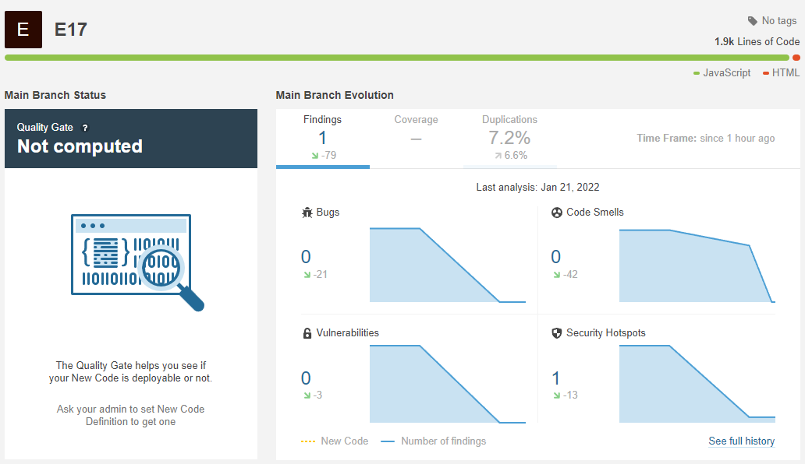
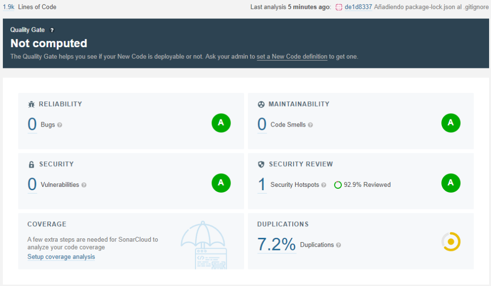

# Continous Code Quality with Sonar Qube - StackParts: Make It Real

En esta iteracion vamos a configurar el cubrimiento de codigo continuo. Para eso debemos configurar las opciones desde Sonar Cloud, en el cual seleccionabamos el repositorio de la organizacion, luego, la propia aplicacion, al detectar cualquier tipo de movimiento, ya sea push o pull request, analizara el codigo automaticamente.

[Link a SonarCloud](https://sonarcloud.io/project/overview?id=SyTW-2122_E17)

En informacion del repo en SonarCloud podemos obtener las badges que podemos incluir en nuestro Readme:

